# Trax — SmartMet Contouring Library

Trax is a high-performance C++ library for generating **isobands** (filled contour polygons between two data values) and **isolines** (contour lines at a single data value) from 2D gridded scalar data. It is developed by the Finnish Meteorological Institute (FMI) as part of the SmartMet server platform and released under the MIT license.

---

## Table of Contents

1. [Quick Start](#quick-start)
2. [Core Concepts](#core-concepts)
3. [Public API Reference](#public-api-reference)
   - [Grid — providing data](#grid--providing-data)
   - [IsobandLimits and IsolineValues — specifying levels](#isobandlimits-and-isolinevalues--specifying-levels)
   - [Contour — running the algorithm](#contour--running-the-algorithm)
   - [GeometryCollection — reading results](#geometrycollection--reading-results)
   - [Interpolation modes](#interpolation-modes)
   - [Bilinear cell subdivision](#bilinear-cell-subdivision)
4. [Handling Missing Values in Data](#handling-missing-values-in-data)
5. [Using Missing-Value Limits to Contour NaN Areas](#using-missing-value-limits-to-contour-nan-areas)
6. [How the Algorithm Works](#how-the-algorithm-works)
   - [Cell layout and classification](#cell-layout-and-classification)
   - [The basic cell shapes](#the-basic-cell-shapes)
   - [Saddle points and the centre value](#saddle-points-and-the-centre-value)
   - [Special case: corner exactly on a limit](#special-case-corner-exactly-on-a-limit)
   - [Special case: ridge edges (equal-value endpoints)](#special-case-ridge-edges-equal-value-endpoints)
   - [Special case: melt — saddle with diagonal corners on the upper limit](#special-case-melt--saddle-with-diagonal-corners-on-the-upper-limit)
   - [Special case: double saddle (BABA / ABAB)](#special-case-double-saddle-baba--abab)
   - [Special case: NaN corner — triangular contouring](#special-case-nan-corner--triangular-contouring)
7. [Output Integration (OGR / GEOS)](#output-integration-ogr--geos)
8. [Performance Design](#performance-design)
   - [Parallel level-subset processing](#parallel-level-subset-processing)
9. [Build and Dependencies](#build-and-dependencies)

---

## Quick Start

```cpp
#include <trax/Contour.h>
#include <trax/Grid.h>
#include <trax/IsobandLimits.h>
#include <trax/IsolineValues.h>
#include <trax/InterpolationType.h>

// ── Step 1: implement the Grid interface ──────────────────────────────────────

class MyGrid : public Trax::Grid {
    int nx, ny;
    std::vector<float> data;       // row-major, NaN for missing
    std::vector<double> xs, ys;    // coordinate arrays

public:
    MyGrid(int nx, int ny, ...) : nx(nx), ny(ny) { ... }

    double x(long i, long j) const override { return xs[i]; }
    double y(long i, long j) const override { return ys[j]; }
    float operator()(long i, long j) const override { return data[j * nx + i]; }
    void set(long i, long j, float z) override { data[j * nx + i] = z; }
    bool valid(long i, long j) const override { return true; } // see below
    std::size_t width()  const override { return nx; }
    std::size_t height() const override { return ny; }
};

// ── Step 2: define contour levels ─────────────────────────────────────────────

Trax::IsobandLimits limits;
limits.add(0.0f, 10.0f);
limits.add(10.0f, 20.0f);
limits.add(20.0f, std::numeric_limits<float>::infinity());  // 20 and above
limits.add(std::numeric_limits<float>::quiet_NaN(),
           std::numeric_limits<float>::quiet_NaN());        // missing-data areas

// ── Step 3: run the contourer ─────────────────────────────────────────────────

Trax::Contour contourer;
contourer.interpolation(Trax::InterpolationType::Linear);
contourer.closed_range(true);   // make the last finite band include its upper limit

MyGrid grid(nx, ny, ...);
auto results = contourer.isobands(grid, limits);

// ── Step 4: use results (indexed in the original add() order) ─────────────────

for (std::size_t i = 0; i < results.size(); i++) {
    std::cout << results[i].wkt() << "\n";
    for (const auto& polygon : results[i].polygons()) { ... }
}
```

---

## Core Concepts

### Isoband vs. isoline

| Type | Meaning | Output geometries |
|---|---|---|
| **Isoband** | `lo <= value < hi` (half-open) | `Polygon` objects |
| **Isoline** | Contour line at exactly `value` | `Polyline` objects |

### Range semantics

Isoband ranges are half-open: `[lo, hi)`. Adjacent ranges like `[0, 10)` and `[10, 20)` tile the value space without overlap or gap. The classification of a corner value `v` against a range `[lo, hi)` is:

- `v < lo` → **Below**
- `lo <= v < hi` → **Inside**
- `v >= hi` → **Above**

A value exactly equal to `lo` is **Inside** (included). A value exactly equal to `hi` is **Above** (excluded) and will be **Inside** the next range whose `lo` equals that `hi`. This is the only way the ranges remain non-overlapping.

Special care is required when a data value is exactly equal to a range boundary — see [Exact Boundary Collisions](#exact-boundary-collisions-in-weather-data) below.

A degenerate point range `(X, X)` would be empty under these semantics — no value satisfies `X <= v < X`. The `Range` constructor detects this and automatically bumps `hi` by one ULP (using `std::nextafter`), turning the range into `[X, X+ε)`, which captures exactly `X`.

The `closed_range(true)` option applies the same ULP bump to the upper bound of the last finite range, so that a data maximum exactly equal to that bound is included rather than classified as Above.

### Output ordering

Results are returned in the same order that levels were `add()`-ed, regardless of whether the library internally re-sorts them. This lets you map `results[i]` directly to the `i`-th `add()` call.

---

## Public API Reference

### Grid — providing data

The user must subclass `Trax::Grid` and implement these pure virtual methods:

```cpp
class Grid {
public:
    virtual double x(long i, long j) const = 0;         // X coordinate at column i, row j
    virtual double y(long i, long j) const = 0;         // Y coordinate at column i, row j
    virtual float operator()(long i, long j) const = 0; // data value; NaN means missing
    virtual void set(long i, long j, float z) = 0;      // write a data value
    virtual bool valid(long i, long j) const = 0;       // can cell (i,j)..(i+1,j+1) be processed?
    virtual std::size_t width()  const = 0;             // number of columns
    virtual std::size_t height() const = 0;             // number of rows

    // Optional overrides:
    virtual std::size_t shift() const;         // default 0; non-zero enables global wrap-around
    virtual std::array<long,4> bbox() const;   // default {0,0,width-2,height-2}; sub-grid
    virtual double shell() const;              // default NaN; border width for midpoint mode
};
```

**`valid(i, j)`** controls whether a 2×2 cell should be processed at all. Returning `false` skips the cell entirely regardless of data values. Typically used when the grid has invalid coordinate projections at the poles or at the edges of projected domains. It does **not** need to check data NaN — that is handled inside the algorithm.

**`shift()`** enables seamless contouring across the antimeridian on global grids. When `shift = k`, column `k` is treated as wrapping around to column `0`. The algorithm internally splits iteration into two sub-loops to handle the join without a seam artefact.

**`bbox()`** restricts contouring to a sub-region of the grid: `{i_min, j_min, i_max, j_max}` in cell coordinates (where `i_max = width - 2` covers all columns). Use this to avoid re-running on unchanged parts of a large grid.

**`shell()`** is used only with `InterpolationType::Midpoint`. A non-NaN value clips a border band of that width around the grid, preventing midpoint contours from reaching the very edges.

---

### IsobandLimits and IsolineValues — specifying levels

```cpp
Trax::IsobandLimits limits;
limits.add(float lo, float hi);                      // add a single range
limits.add(const std::vector<Trax::Range>& ranges);  // add multiple ranges

Trax::IsolineValues values;
values.add(float value);
values.add(const std::vector<float>& values);
```

Both containers accept:
- Finite values
- `std::numeric_limits<float>::infinity()` / `-infinity()` for open-ended bands
- `std::numeric_limits<float>::quiet_NaN()` (see [Missing-Value Limits](#using-missing-value-limits-to-contour-nan-areas))

**Range construction rules for `IsobandLimits`:**
- `lo <= hi` is required for finite bounds.
- If `lo == hi` (degenerate point range), `hi` is automatically bumped by one ULP so the range captures exactly that value.
- Exactly one of `lo`/`hi` being NaN is not allowed; both must be NaN together.
- `(-inf, X)` and `(X, +inf)` are valid and capture all values below or above X.

---

### Contour — running the algorithm

```cpp
class Contour {
public:
    Contour();

    // Configuration — call before isobands() / isolines()
    void interpolation(InterpolationType itype);  // default: Linear
    void closed_range(bool flag);                 // default: false
    void strict(bool flag);                       // default: false
    void validate(bool flag);                     // default: false
    void desliver(bool flag);                     // default: false
    void threads(int n);                          // default: 1 (see below)
    void subdivide(int n);                        // default: 0 (off, see below), max 10

    // Computation
    GeometryCollections isobands(const Grid& grid, const IsobandLimits& limits);
    GeometryCollections isolines(const Grid& grid, const IsolineValues& values);
};
```

**`strict(true)`** makes topology errors throw exceptions instead of silently discarding the malformed fragment. Useful for debugging or unit tests.

**`validate(true)`** runs GEOS `IsValidOp` on every output geometry. This is very slow and intended only for debugging. Combined with `strict(true)`, invalid geometries throw; otherwise they are printed to stderr.

**`desliver(true)`** removes degenerate sliver geometries from output.

**`subdivide(n)`** enables bilinear densification of cell level-curve segments. The default `0` keeps the classic linear marching-squares output (one straight segment between each pair of edge intersections). A non-zero `n` splits every interior level-curve segment into `n` sub-segments and inserts `n-1` samples on the true bilinear level curve between the edge intersections. The edge intersections themselves stay bit-identical so adjacent cells still stitch together correctly. See [Bilinear cell subdivision](#bilinear-cell-subdivision) for details. Clamped to the range `[0, 10]`; `1` is a valid but no-op value.

**`threads(n)`** controls how many threads are used to parallelise contouring across isoband/isoline levels:

| Value | Meaning |
|---|---|
| `1` | Single-threaded (default) |
| `N > 1` | Use exactly N threads |
| `0` | Auto: use `std::thread::hardware_concurrency()` threads |

See [Parallel level-subset processing](#parallel-level-subset-processing) for details.

The `Contour` object is not copyable or movable. It is safe to call `isobands()` / `isolines()` multiple times on the same object with different grids or limits.

---

### GeometryCollection — reading results

```cpp
class GeometryCollection {
public:
    bool empty() const;
    const std::vector<Polygon>& polygons()  const;
    const std::vector<Polyline>& polylines() const;
    std::string wkt() const;               // WKT string, see below
    void wkb(std::ostringstream& out) const;
};
```

`wkt()` returns the most specific WKT type that fits:

| Contents | WKT type |
|---|---|
| Empty | `GEOMETRYCOLLECTION EMPTY` |
| One polygon, no holes | `POLYGON ((...))` |
| One polygon with holes | `POLYGON ((...), (...))` |
| Multiple polygons | `MULTIPOLYGON (...)` |
| Lines only (one) | `LINESTRING (...)` |
| Lines only (multiple) | `MULTILINESTRING (...)` |
| Mixed polygons and lines | `GEOMETRYCOLLECTION (MULTIPOLYGON (...), MULTILINESTRING (...))` |

Each `Polygon` has one exterior `Polyline` and zero or more hole `Polyline`s. Each `Polyline` is a sequence of `(x, y)` coordinate pairs.

---

### Interpolation modes

```cpp
enum class InterpolationType : std::uint8_t {
    Linear,       // default; exact isovalue crossing positions
    Midpoint,     // contour lines pass through cell-edge midpoints
    Logarithmic   // uses log1p transform; for exponential-scale data (e.g. radar)
};

// String conversion (for config files):
InterpolationType itype = Trax::to_interpolation_type("linear");
// accepts: "linear", "nearest", "discrete", "midpoint", "logarithmic"
```

**Linear** computes exact intersection positions by linear interpolation along each edge: `pos = (threshold - v2) / (v1 - v2)`. Coordinates are stored as `double` for sub-pixel WMS accuracy.

**Midpoint** (nearest-neighbour / discrete) places all intersection points at the midpoints of grid cell edges instead of at the exact isovalue crossing. This produces shorter, smoother contour paths that are less sensitive to noise in the data, at the cost of not being exactly at the isovalue. Only available for isobands. The `Grid::shell()` method can clip a border band.

**Logarithmic** substitutes `log1p(z)` for each value before interpolating, then maps back. This compresses the high end of exponential-scale data (such as radar reflectivity), producing more evenly distributed contour lines across the dynamic range. The saddle-point disambiguation uses the geometric mean of the four cell corners. Log values are lazily computed and cached per-cell to avoid redundant calls.

---

### Bilinear cell subdivision

Classic marching squares draws a straight segment between the two edge intersections that a cell's level curve crosses. Inside a grid cell the true bilinear interpolant `f(u, v) = f₁ + (f₄−f₁)·u + (f₂−f₁)·v + (f₁+f₃−f₂−f₄)·u·v` has level sets that are **hyperbolas**, not straight lines — the straight-segment approximation visibly fails when a single high cell is surrounded by low cells (radar pixel, temperature extreme) and produces a sharp diamond instead of a curved blob.

Calling `Contour::subdivide(n)` with `n >= 2` asks the contouring pipeline to insert `n-1` interior samples on the true bilinear level curve between each pair of edge intersections, splitting one straight segment into `n` shorter chords that track the hyperbola:

```cpp
Trax::Contour contourer;
contourer.interpolation(Trax::InterpolationType::Linear);
contourer.subdivide(4);   // split each curve segment into 4 chords (3 interior samples)
auto result = contourer.isobands(grid, limits);
```

Accepted values are `0..10`:
- `0` (default): off. Output is bit-identical to pre-subdivide trax.
- `1`: documented no-op (one sub-segment, zero interior samples); accepted so a caller-exposed control knob can scale linearly from "off" through "maximum smoothing" without special-casing.
- `2..10`: increasing densification. Sample positions are computed analytically from the bilinear coefficients, so the samples land exactly on the hyperbola — no iterative solver.

**Edge-intersection invariant.** The vertices on each cell edge (where two neighbouring cells have to agree) are produced by the same `intersect()` as the non-subdivided path and written with the same `(column, row, VertexType)` merge key. Adjacent cells still stitch cleanly along shared edges regardless of which `subdivide` values their contouring used. Interior samples use a dedicated `VertexType::Interior` with sentinel coordinates that cannot collide with any edge-intersection key.

**Which cell configurations are densified.** The `build_linear` dispatch densifies corner triangles, side rectangles, side stripes, pentagons, hexagons, and single-level saddles — together covering the vast majority of real-world cell topologies. Two exceptions remain piecewise-linear:
- The two **double-saddle** configurations (`Below/Above/Below/Above` and `Above/Below/Above/Below`) where the value crosses both the lo and hi limits on every edge. These rings carry a hand-tuned ghost-flag encoding that densify would need to match edge-by-edge; touching them is deferred.
- The **NaN-triangle** cases (cells with exactly one NaN corner). Their phantom diagonal is a triangle-bilinear curve, different from the quad-bilinear densify kernel.

**Numerics on the single-peak test.** The unit test `subdivide_peak_bilinear_curve` contours a 3×3 grid with one peak of 10 surrounded by zeros at isoband `[1, ∞)`:

| subdivide | linear area | % of analytical bilinear (267.90) |
|----|-------|---|
| 0 | 162.00 | 60% |
| 2 | 228.27 | 85% |
| 4 | 254.83 | 95% |
| 8 | ~265 | ~99% |
| 10 | ~266 | ~99.3% |

The bilinear level curve of a peak-in-zeros cell bends **outward** away from the peak (the hyperbola bulges into the low-value side), so the densified isoband has a **larger area** than the linear diamond, not smaller. For radar-style data where the goal is to suppress a lone-pixel diamond, `subdivide` replaces the sharp shape with a rounded four-lobed blob but does not shrink it. To shrink, use `InterpolationType::Logarithmic` or the Savitzky-Golay smoother at the data-preprocessing stage.

**When the effect is visible on rendered output.** The maximum deviation between the straight segment and the bilinear curve scales with `cell_size × |D| / (hi − lo)` where `D = f₁ + f₃ − f₂ − f₄`. On synthetic grids where one cell fills many screen pixels and corner values contrast strongly, the improvement is dramatic. On smooth real-world data at typical zoom where each cell maps to ~1 screen pixel, the improvement is sub-pixel. Bilinear subdivision is specifically worth it for cells that simultaneously (a) render large relative to pixel and (b) have high corner contrast.

---

## Handling Missing Values in Data

Grid data values of `NaN` (not-a-number) represent missing or undefined data. The algorithm handles them natively without any pre-processing step.

### What happens to cells with NaN corners

Each grid corner is classified as one of:
- `Below` — value is below the isoband's lower limit
- `Inside` — value is within the isoband
- `Above` — value is above the isoband's upper limit
- `Invalid` — value is NaN

A cell with **all four corners valid** is processed normally using the full 256-case marching-squares dispatch table.

A cell with **exactly one NaN corner** is treated as a triangle: the three valid corners form a triangle, and contouring proceeds within that triangle using a 64-case dispatch table for triangular cells.

A cell with **two or more NaN corners** is skipped: no contour fragment is generated for that cell. The missing-data region simply has no coverage for normal isobands.

### Grid::valid() vs. NaN data values

`Grid::valid(i, j)` is a cell-level gate that can skip an entire 2×2 cell before any data is read — useful when the coordinate projection itself is invalid (e.g., near poles). Data NaN handling operates independently and does not require `valid()` to return `false`.

### Effect on output topology

When data has scattered NaN values, the resulting polygons will have clean boundaries that follow the triangle edges between valid and invalid corners. Output polygons are topologically valid and do not have holes where NaN values appear — those areas simply do not appear in any isoband unless a NaN-range is explicitly requested (see below).

---

## Using Missing-Value Limits to Contour NaN Areas

This is one of Trax's most useful features: you can explicitly request contours that cover the missing-data areas, or that trace the boundary between valid and missing data.

### Isoband over missing data: `Range(NaN, NaN)`

Adding a `NaN, NaN` range to `IsobandLimits` generates filled polygons that cover exactly the regions where the grid data is `NaN`:

```cpp
auto nan = std::numeric_limits<float>::quiet_NaN();

Trax::IsobandLimits limits;
limits.add(0.0f, 10.0f);    // normal band
limits.add(nan, nan);       // polygons covering missing-data areas
```

The `Range(NaN, NaN)` range is sorted to position 0 internally (processed first) but returned at the index of its original `add()` call.

The algorithm uses a reversed NaN logic for these cells: NaN corners are treated as `Inside` and finite corners as `Below`. This produces filled polygons where data is missing.

- Cells with one NaN corner → a triangle covering the missing corner
- Cells with two NaN corners → a quadrilateral strip
- Cells with three NaN corners → a larger triangle
- Cells with all four NaN corners → the full cell square

The result can be used to mask missing-data areas in a rendered map (e.g., fill them grey or transparent).

### Isoline at the missing-data boundary: `NaN` value

Adding `NaN` as an isoline value generates open polylines that trace the **boundary between valid and missing data**:

```cpp
auto nan = std::numeric_limits<float>::quiet_NaN();

Trax::IsolineValues values;
values.add(5.0f);    // normal isoline
values.add(nan);     // boundary between valid and missing data
```

This uses the same reversed-NaN logic as the isoband case, but in isoline mode the shared edges between NaN and non-NaN cells are extracted as open polylines. The result is a precise boundary curve you can use for clipping, hatching, or highlighting.

### Infinite limits for open-ended bands

To capture all data below a threshold or above a threshold, use infinity:

```cpp
auto inf = std::numeric_limits<float>::infinity();
auto nan = std::numeric_limits<float>::quiet_NaN();

Trax::IsobandLimits limits;
limits.add(-inf, 0.0f);    // all values below 0
limits.add(0.0f, 10.0f);
limits.add(10.0f, inf);    // all values above 10
limits.add(nan, nan);      // missing
```

Combined with `NaN, NaN`, this setup partitions the entire grid surface (including missing areas) into non-overlapping, non-gapping isobands. The union of all result polygons exactly covers the bounding box of the valid grid domain.

---

## How the Algorithm Works

Trax uses **marching squares** — the same family of algorithm summarised on the [Wikipedia page](https://en.wikipedia.org/wiki/Marching_squares). Wikipedia's presentation assumes a clean, theoretical grid: every isoline crosses each cell edge in at most one place, no corner ever falls exactly on a contour level, and saddles can be resolved with a single global rule. None of those assumptions hold for real meteorological forecasts. This section walks through how trax extends the textbook algorithm so that quantised weather data, missing values, and pathological corner placements all produce clean polygons.

The presentation here is for **isobands** (filled half-open ranges `[lo, hi)`), which is where most of the complexity lives. Isolines use the same machinery with `Below` / `Above` classifications around a single value.

### Cell layout and classification

Each interior 2×2 block of grid points is one **cell**. Trax labels the four corners clockwise from the bottom-left:

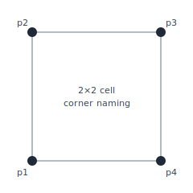

Every corner is classified against the active isoband range `[lo, hi)`:

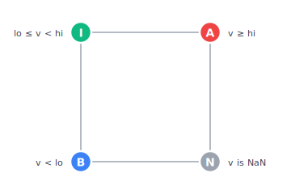

| Symbol | `Place` enum | Condition |
|--------|--------------|-----------|
| **B** | `Below`   | `value < lo` |
| **I** | `Inside`  | `lo ≤ value < hi` |
| **A** | `Above`   | `value ≥ hi` |
| **N** | `Invalid` | `value` is NaN |

The four classifications are packed into a single integer (`place_hash(p1, p2, p3, p4)`) that selects one of 256 cases via a `switch` (compiled as a jump table). For pure isolines there are only two classifications (`Below`, `Above`), shrinking the dispatch to the classic 16 Wikipedia cases — but every isoband table entry is essentially a pair of those isoline cases, one for `lo` and one for `hi`, which is what blows the case count up.

In the figures below, the **Inside** region of each cell is shaded green (the isoband fill that trax outputs), the **Below** region pale blue, and the **Above** region pale pink. Black lines trace the polygon edges that the cell contributes.

### The basic cell shapes

After excluding the trivial uniform cases (`BBBB` and `AAAA` produce no output, `IIII` outputs the whole cell), every remaining cell falls into one of a handful of geometric shapes. Wikipedia covers only the shapes that arise when a single contour level crosses a cell. For an isoband, both `lo` and `hi` may cross the same cell, so the shape vocabulary is larger.

**All-Inside** — every corner is Inside the band, so the polygon is the whole cell:

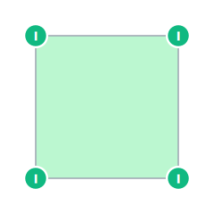

**Corner triangle** — exactly one corner Inside, the other three all Below (or all Above). Trax traces a triangle clipped off the Inside corner, with two vertices on the adjacent cell edges and one literal corner vertex:

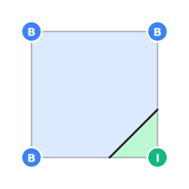

**Side rectangle** — two adjacent corners on the same side are Inside, the opposite two are uniformly Below or Above. The fill is bounded by one edge of the cell and one `lo`-level segment:

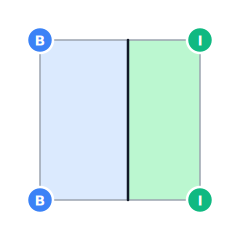

**Side stripe** — three corners are Below and the remaining diagonal corner is Above (or vice versa). Both `lo` and `hi` cross the same two edges, so the bottom and right edges each carry two intersections; the Inside band is the thin diagonal slice between them:

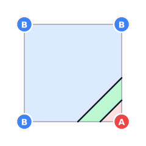

**Pentagon** — three different classifications appear in the same cell, e.g. one Below corner, one Inside, two Above. The polygon walks the Inside corner → top edge `hi` cut → bottom edge `hi` cut → bottom edge `lo` cut → left edge `lo` cut, picking up five vertices on the way:

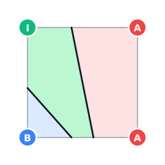

**Hexagon** — two adjacent Inside corners with the other two corners split between Below and Above. Six vertices: the two Inside corners (literal), plus two cuts on the `lo` side and two on the `hi` side:

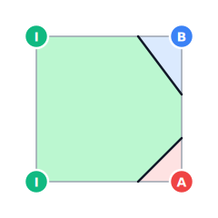

These shape categories plus the saddles below cover almost every cell that arises in practice. They are also the cell types that the optional `Contour::subdivide(n)` densifier inserts bilinear samples into — see [Bilinear cell subdivision](#bilinear-cell-subdivision).

### Saddle points and the centre value

The classic ambiguity. When opposite corners share a classification, two topologically different polygons fit the same corner labels — one connected hexagon, or two disjoint triangles:

| Connected (centre Inside) | Split (centre Below) |
|:---:|:---:|
| 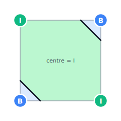 | 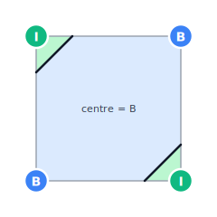 |

The marching-squares hash alone cannot tell which is correct. Trax picks the topology by sampling the **centre** of the cell — the bilinear interpolant `(p1 + p2 + p3 + p4) / 4` (or the geometric mean in `Logarithmic` mode):

- If `centre` is **Inside** the band, the two Inside corners are connected through the middle (the hexagon, left).
- Otherwise the cell splits into two disjoint triangles (right).

Note that the actual cut positions on each edge differ between the two cases: when the centre is Inside, the gradient is gentle and the lo cuts land close to the B corners (large hexagon, small B triangles). When the centre is Below, the gradient is steep near the I corners and the lo cuts land close to those corners (small I triangles, mostly Below background). The same disambiguation runs for all saddle hashes: `BIBI`, `IAIA`, `IBIB`, `AIAI`, plus the mixed-saddle cases like `BIBA`, `AIBI`, etc.

### Special case: corner exactly on a limit

Weather model output is commonly stored at reduced precision. MEPS precipitation is rounded to one decimal place. When the isoband limits are also expressed in tenths (e.g. `0.1`, `0.2`, `0.3`), every value in the grid is an integer multiple of the limit step and will collide **exactly** with a range boundary. On a large grid this happens millions of times per render, not as a corner case.

The standard linear interpolation along an edge is

```
s = (limit - v2) / (v1 - v2)
```

If `v1 == limit` the formula returns `1.0` (correct, but only by accident of arithmetic). If *both* endpoints equal the limit, `0/0` produces `NaN` or `±inf` and the contour vertex disappears. More subtly, a corner value exactly equal to `hi` is classified as `Above` for the current range *and* as `Below` for the next range — the two adjacent ranges may both call `intersect()` with conflicting expectations.

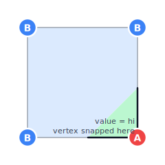

When `p4.z` exactly equals `hi`, the polygon vertex must land *precisely* on the corner. Without a guard, near-zero divisors in the interpolation formula would put the vertex slightly off the corner with rounding-dependent jitter — the two adjacent isoband rings would no longer share an exact T-junction. Trax's `intersect()` short-circuits the interpolation whenever an endpoint is exactly on the limit:

```cpp
if (p1.z == value)  return the corner coordinates of p1 as a VertexType::Corner;
if (p2.z == value)  return the corner coordinates of p2 as a VertexType::Corner;
```

The contour vertex is placed precisely at the grid corner — no arithmetic, no division, no rounding. This guard was added in response to MEPS forecast artefacts (Brainstorm-2679) and is the load-bearing fix for quantised weather data.

The `closed_range(true)` option provides a complementary safety net: it bumps the *upper* bound of the last finite range by one ULP via `std::nextafter`, so a data maximum exactly equal to the nominal cap is classified as `Inside` instead of being lost off the top.

### Special case: ridge edges (equal-value endpoints)

A subtler problem appears in **isoline** mode. Suppose the isoline value is `X` and a cell edge has both endpoints exactly equal to `X`:

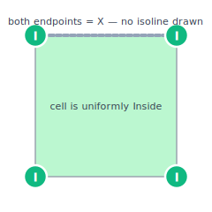

The dashed grey line marks an edge whose both endpoints have the isoline value `X`, but neither side of the edge is the wrong side — the whole cell is Inside the band. A naive "draw a line wherever value == X" would paint the entire edge as an isoline, even though the colour does not change across it. The result is a stray line drawn through the middle of a uniformly-coloured isoband. Because operational weather data is rounded to coarse units, ridges of constant `X` are common, not exotic.

Trax solves this with the **ghost** flag carried on every emitted vertex. `Vertex::ghost` is set to true whenever the vertex sits on an edge that is not a true band boundary (its endpoints both sit on the limit and the cell shading does not actually flip across the edge). For isobands the ghost vertices are kept in the polygon ring — the ring is still topologically closed. For isolines, `Polyline::remove_ghosts` strips ghost-flagged runs out of the ring, so ridges are silently dropped.

The book-keeping is "load-bearing": every code path that creates a vertex must pass the right ghost value, and the double-saddle case in particular has hand-tuned ghost-flag inversions on its right and bottom edges. Twenty years of iteration on trax has been mostly about getting these flags right — the cell hash dispatch itself is short.

### Special case: melt — saddle with diagonal corners on the upper limit

In an `AIAI` or `IAIA` saddle (two diagonal Above corners, two diagonal Inside corners), the Above corners may have value exactly equal to `hi`:

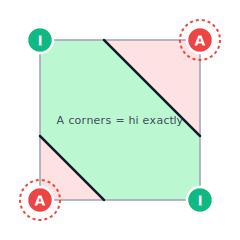

The dashed red rings mark the two Above corners whose values equal `hi` exactly. The diagonal corners are nominally Above, so the centre-value rule would pick the split topology. But because the corners are *literally on* the upper boundary, splitting introduces a degenerate point-touch between the two Inside lobes. Trax detects this with

```cpp
const bool melt = (c.p1.z == m_range.hi() && c.p3.z == m_range.hi());
```

and forces the connected (hexagon) topology regardless of what the centre value says. The same `melt` test runs for the mirror-image cases on different corner pairs (`p2 == hi && p4 == hi`).

### Special case: double saddle (BABA / ABAB)

The most pathological cell: every edge crosses **both** `lo` and `hi`, because the four corners alternate between Below and Above with no Inside corner anywhere. This happens for narrow bands when the data oscillates faster than the cell size resolves.

| centre = I (connected) | centre = B (two stripes) | centre = A (mirrored) |
|:---:|:---:|:---:|
| 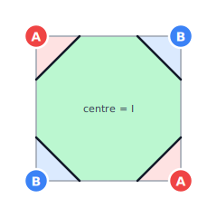 | 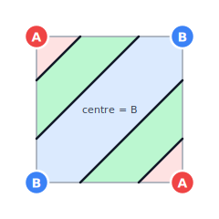 | 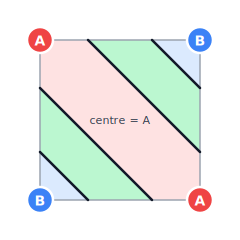 |

The cell may contribute up to **eight** vertices in a single ring (every edge donates two cuts: one for `lo`, one for `hi`). Three sub-cases are dispatched on the centre value:

- **`cc == Inside`** (left) — the four-edge ring is connected as one octagonal Inside band threading around the cell, with the `lo` and `hi` cuts on each edge alternating around the perimeter. Above lobes appear at the two A corners, Below lobes at the two B corners.
- **`cc == Below`** (centre) — the ring splits into two diagonal stripes, each wrapping one of the two A corners. The centre and the rest of the cell are Below.
- **`cc == Above`** (right) — mirror image: two stripes wrap the two B corners; the centre is Above.

The double-saddle cases also invert several ghost flags compared to the surrounding cases. This is **not** a bug or a stylistic choice; it is exactly the encoding that lets `Polyline::remove_ghosts` extract the right isoline pieces from a single 8-vertex ring. The two double-saddle hashes are explicitly excluded from `Contour::subdivide()` densification because the densifier would have to thread the same ghost-flag pattern edge-by-edge, and that has not been worked through yet.

The `melt` test (described above) also applies to the BABA / ABAB cases when the diagonal Above corners both equal `hi`, forcing the connected topology in that subcase.

### Special case: NaN corner — triangular contouring

When a single corner is NaN (typically masked terrain, ocean cells in a land-only product, or the bbox edge of a sub-grid), the cell collapses to a triangle. The three valid corners and a *phantom diagonal* across the NaN corner form a 3-edge boundary:

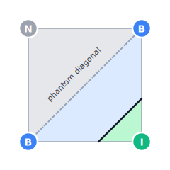

The dashed grey line is the phantom diagonal — it splits the cell so that the NaN half (gray) is excluded and the contouring algorithm walks only the three remaining edges of the valid triangle. Trax dispatches these with `nan_hash(...)` and a smaller switch (4 × 27 = 108 entries) that walks the triangle one edge at a time using `build_edge`. Because triangular cells have no opposite-corner pairs they can never be saddles, so no centre-value disambiguation is needed — every NaN-corner case is unambiguous from the three valid corner classifications alone.

Cells with **two or more** NaN corners are skipped; no contour fragment is generated. To fill in those regions explicitly, add a `Range(NaN, NaN)` to `IsobandLimits` — see [Using Missing-Value Limits](#using-missing-value-limits-to-contour-nan-areas) — or a `NaN` value to `IsolineValues` for the boundary curve.

The phantom diagonal on a NaN-triangle cell is a true bilinear curve too, but its bilinear coefficients differ from the four-corner cell, so the `Contour::subdivide()` densifier intentionally leaves NaN-triangle cases piecewise-linear.

---

## Output Integration (OGR / GEOS)

```cpp
#include <trax/OGR.h>
#include <trax/Geos.h>

// Convert a GeometryCollection to an OGR geometry (gdal/ogr)
std::unique_ptr<OGRGeometry> ogr_geom = Trax::to_ogr_geom(results[0]);

// Convert to a GEOS geometry
auto factory = geos::geom::GeometryFactory::create();
auto geos_geom = Trax::to_geos_geom(results[0], factory);
```

These helpers allow downstream processing such as reprojection, spatial queries, or format conversion using the full GDAL/GEOS ecosystem.

---

## Performance Design

Trax is optimized for throughput on large meteorological grids. The key design decisions are:

### Marching-squares jump table

Each 2×2 cell is classified by hashing the four corner placements (`Below`, `Inside`, `Above`, `Invalid`) into a single integer:

```
hash = place(c1) + 4 * (place(c2) + 4 * (place(c3) + 4 * place(c4)))
```

This gives a value in `[0, 255]` dispatched via a `switch` statement, which the compiler converts to a branch-free jump table. Triangular cells use a 64-entry table; edge cases use a 16-entry table. No virtual dispatch, no dynamic polymorphism in the hot path.

### Simultaneous processing of all levels — no search tree needed

Some contouring libraries build a 2D spatial index or an interval search tree over the data matrix so that, for each isoband level, only the relevant cells can be found quickly. The cost of that approach is a full scan of the grid to build the index before any contouring begins.

Trax takes a different approach: **all isoband levels are processed simultaneously in a single pass over the grid**, handling every applicable level for each cell before moving to the next. This eliminates the need for any pre-built index. To keep the per-cell work small, all isoband levels are sorted before contouring starts, and the algorithm maintains two persistent indices (`m_min_index`, `m_max_index`) that form a sliding window over the sorted level list. The window covers exactly those levels whose range `[lo, hi)` overlaps the current cell's `[min, max]` value range; levels outside the window are skipped for that cell.

Because adjacent cells on a meteorological grid have similar values, the window barely moves from one cell to the next — a short bidirectional linear scan of a few steps is all that is needed to update it. The amortized cost is O(1) per cell regardless of how many isoband levels were requested.

The isoband levels are sorted internally to make this sliding-window approach work. The original order supplied by the caller is recorded beforehand and restored when assembling the output, so `results[i]` always corresponds to the `i`-th `add()` call.

### Parallel level-subset processing

When `threads(N)` or `threads(0)` is set, the sorted isoband or isoline levels are divided into N equal-sized slices. Each slice is processed by an independent `std::async` task that runs a complete grid pass for its subset of levels. The grid is shared read-only across all threads.

The NaN/missing range (always sorted to index 0) is assigned entirely to thread 0's slice, so `m_contour_missing` logic is preserved within that thread without any cross-thread coordination.

Each thread works with its own `Builder`, `JointMerger`, and `JointPool` instances — there is no shared mutable state between threads during the grid pass. After all threads complete, the partial results are merged back into the final `GeometryCollections` using the global `original_position()` mapping, restoring the user's original level order.

If the resolved thread count exceeds the number of finite levels, it is capped so that every thread has at least one level to process. If the cap reduces the count to 1, the single-threaded path is taken with no threading overhead.

The `validate` and `desliver` steps are applied to the merged result after all threads finish, not per-thread.

### Row buffering with swap

Grid values and coordinates are loaded into two buffered rows (`row1`, `row2`). After processing each row the buffers are `std::swap()`-ped, so the upper row becomes the lower row without copying. Only one new row of data is loaded per iteration.

### JointPool arena allocator

All internal `Joint` node objects (the graph nodes that represent vertex connections) are allocated from a doubling-size arena pool. The pool starts at 16,384 elements and doubles on overflow. This eliminates `new`/`delete` per node, dramatically reducing allocator overhead and improving cache locality. Pool destruction is O(1) (a few block frees).

### SmallVector for per-cell vertices

Each cell produces at most 8 contour vertices. These are stored in a `SmallVector<Vertex, 8>` — a stack-allocated fixed array — so no heap allocation occurs per cell.

### Logarithmic mode lazy caching

In logarithmic mode, `log1p(z)` for each of the four cell corners is computed on first use and cached. When a cell is evaluated for multiple isoband levels (which share the same four corners), the log values are reused rather than recomputed.

### Compile-time template specialization

`JointBuilder<bool Logarithmic>` is a template. All logarithmic code paths use `if constexpr` and are dead-code-eliminated when `Logarithmic = false`. Normal (linear) mode has zero overhead from the logarithmic feature.

### Ghost-edge cancellation

Adjacent antiparallel edges from neighboring cells are detected and cancelled immediately during the row-merge pass, before they are ever added to the joint graph. This avoids creating graph nodes for edges that would immediately be removed, which the codebase notes as a significant speedup: "creating Joints to memory buffers is quite slow compared to the other parts of contouring."

### Sorted-row vertex lookup with hint

During row merging, the search for matching vertices on the previous row uses a forward hint starting from the last successful match. Because columns are processed left-to-right and vertices are spatially ordered, consecutive matches are nearly sequential, making the lookup O(1) in practice.

### Hole assignment with R*-tree

When assembling rings into polygons with holes, an R*-tree (`boost::geometry::index::rstar<16>`) over polygon bounding boxes turns hole-to-shell assignment from O(n²) to O(n log n).

### Floating-point reproducibility

Intersection points are always computed with the pair of endpoints in lexicographic order (`(x1,y1) < (x2,y2)`), ensuring that the same grid edge traversed in opposite directions by adjacent cells produces bit-identical intersection coordinates. This eliminates T-junction artefacts.

The Makefile uses `-march=x86-64` rather than the default `-march=x86-64-v3` available on RHEL 10 / Rocky Linux 10. This is intentional: at `-O2` and above, AVX2 FMA instructions introduce non-deterministic floating-point rounding that breaks bit-exact reproducibility. The explicit `-march=x86-64` forces SSE2-only codegen, trading a small performance gain for stable output.

---

## Build and Dependencies

### Building

```sh
make          # builds libsmartmet-trax.so
make install  # installs library and headers
make test     # builds and runs the test suite
```

The build system uses a shared SmartMet makefile fragment from `$(PREFIX)/share/smartmet/devel/makefile.inc`.

### Compiler flags

| Flag | Purpose |
|---|---|
| `-O3` | Full optimization |
| `-march=x86-64` | Reproducible FP — see above |
| `-DUNIX -D_REENTRANT` | Standard SmartMet platform flags |
| `-DUSE_UNSTABLE_GEOS_CPP_API` | Required for GEOS C++ API |

### Required dependencies

| Library | Version | Purpose |
|---|---|---|
| GDAL | ≥ 3.12 | OGR geometry output |
| GEOS | ≥ 3.13 | Geometry validation and output |
| fmt | ≥ 12.0, < 13.0 | String formatting |
| Boost | any recent | `geometry::index` (R*-tree), `math`, `test` |
| smartmet-library-macgyver | current | Exception handling, string utilities |

### Header installation

Headers are installed under `$(includedir)/smartmet/trax/`. Include them as:

```cpp
#include <smartmet/trax/Contour.h>
// or, if includedir is on the search path:
#include <trax/Contour.h>
```

### RPM packaging

The library is packaged as `smartmet-library-trax`. The spec file follows a `YY.MM.patch` version scheme (e.g., `26.2.4`).
